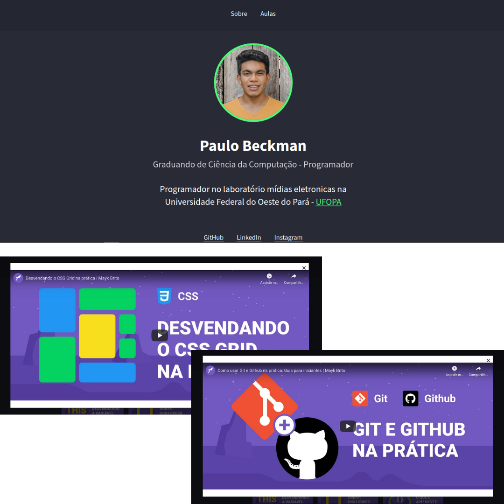
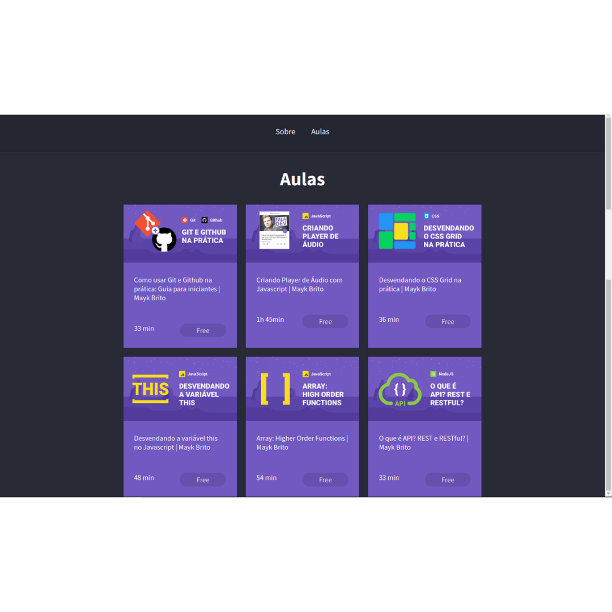

<h1 align="center">
    Web Information And Videos version 1
</h1>
 
<h4 align="center"> 
	🚀 Web Information And Videos version 1 🚀
</h4>

<p align="center">
  

  

  	
  <a href="https://www.linkedin.com/in/paulobeckman/">
    
  </a>
	
  
  <a href="https://github.com/paulobeckman/web-information-and-videos-v1/commits/master">
    
  </a>

  
   <a href="https://github.com/paulobeckman/web-information-and-videos-v1/stargazers">
    
  </a>
</p>
 

## 💻 Sobre o projeto

 ▶ Web information and videos version 1 apresenta as informações sobre um aluno, além de poder redirecionar para todas as redes sociais dele.

O usuário poderá ser redirecionado para:
- acessar o GitHub, LinkedIn e Instagram do aluno.

Na aba aulas o aluno tem acesso a seis cards referentes a vídeos do youtube da [Rocketseat](rs):
- cada card tem uma thumbnail, título, tempo de duração e se o curso e pago ou gratuito;
- ao clicar em cada card, será mostrado o vídeo descrito naquele card, através de uma janela que será aberta na própria página.


Projeto desenvolvido no módulo 02 do curso **LaunchBase** oferecida pela [Rocketseat](rs).
"O [LaunchBase](lb) é um treinamento no formato de bootcamp online que tem duração de 8 semanas. A cada semana os conteúdos são liberados de acordo com um cronograma, guiando o aluno pelas ferramentas e conceitos mais modernos de desenvolvimento que permitirão construir as melhores aplicações e ter acesso às melhores oportunidades como programador." - Rocketseat


### Web

<p align="center" style="display: flex; align-items: flex-start; justify-content: center;">
	
 

  

  
</p>

## 🛠 Tecnologias

As seguintes ferramentas foram usadas na construção do projeto:

- [Java Script][js]
- [CSS][CSS]
- [HTML][HTML]


## 🚀 Como rodar este projeto

Podemos considerar este projeto como tendo uma parte:
1. Front End (todos os arquivos)

💡 É possível rodar a aplicação Front End usando o live server do [Visual Studio Code][vscode] ou dando dois clicks no arquivo about.html.

### Pré-requisitos

Antes de começar, você vai precisar ter instalado em sua máquina as seguintes ferramentas:
Um editor para trabalhar com o código como [VSCode][vscode]
Além disso se preferir usar o live server basta instala-lo como extenção. A instalação é feita dentro do proprio VScode na aba extenção.

### 🧭 Rodando a aplicação web (Front End)

```bash
# Clone este repositório
$ git clone https://github.com/paulobeckman/web-information-and-videos.git

# Acesse a pasta do projeto no terminal/cmd
$ cd web-information-and-videos

# Execute o comando para abrir o projeto no VScode
$ cd code .

#Executre o arquivo index através do live server

# O servidor inciará na porta:127.0.0.1:5501 - acesse http://127.0.0.1:5501/
```


## 📝 Licença

Este projeto esta sobe a licença MIT. Veja a [LICENÇA](license) para saber mais.

Feito por Paulo Beckman 👋🏽 [Entre em contato!](https://www.linkedin.com/in/paulobeckman/)

[vscode]: https://code.visualstudio.com/
[vceditconfig]: https://marketplace.visualstudio.com/items?itemName=EditorConfig.EditorConfig
[license]: https://opensource.org/licenses/MIT
[rs]: https://rocketseat.com.br/
[lb]: https://pages.rocketseat.com.br/launchbase/inscricao/5
[js]: https://developer.mozilla.org/pt-BR/docs/Aprender/JavaScript
[CSS]: https://developer.mozilla.org/pt-BR/docs/Web/CSS
[HTML]: https://developer.mozilla.org/pt-BR/docs/Web/HTML
